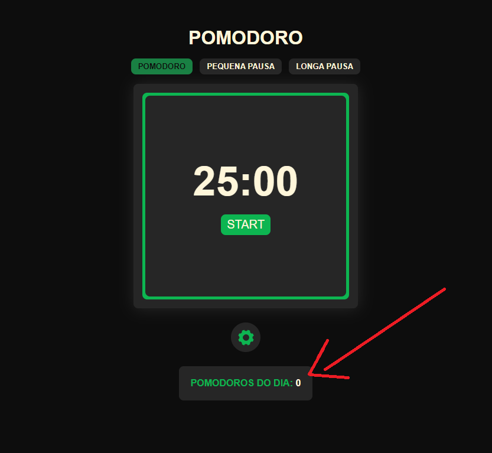

# Pomodoro Jera Academy

Objetivo: Criar uma ferramenta para auxiliar quem trabalha com o método pomodoro (Veja mais sobre o metodo no link: https://www.wikiwand.com/pt/T%C3%A9cnica_pomodoro)

# Requisitos

Escopo:

- Timer 25 min: O timer deve conter uma tela com os minutos e segundos regressivamente;

- Timer de intervalo (5 min) : Uma opção para iniciar o timer como modo de intervalo, com 5 minutos regressivamente (mesmo timer da funcionalidade anterior);

- Som de notificação:  Fazer um som ao terminar o tempo do timer.


Opcional:

- Mostrar notificações na plataforma escolhida (android notification/ ios notification/ chrome notification);

- Ter uma opção para mudar o tempo do pomodoro de 25 minutos para qualquer outro;

- Sugerir para o usuário depois de ter feito 4 pomodoros (timer 25 min) um descanso de  10 min;

- Contar a quantidade de pomodoros feitos no dia.


# Layout

[]()

### Observações

- O Contador de pomodoro so é contabilizado no timer de 25 minutos quando solicitado, se o usuario alterar o timer principal para qualquer outro tempo o pomodoro não vai ser contabilizado.

- Dos requisitos obrigatórios e opcionais o unico que não foi colocado foi o chrome notifications pois a aplicação já possui toasts de sugestões e som ao terminar o contador do timer e optei por não colocar.


# Tecnologias Utilizadas

- Javascript
- ReactJs
- ContextAPI
- Styled-Components
- React-toastify


# Como rodar o projeto

Abra sua linha de comando (cmd, gitbash, zsh) em uma pasta de sua preferencia e execute os seguintes comandos abaixos:

```
 $ git clone https://github.com/zkauansantos/pomodoro-jera.git

 $ cd pomodoro-jera

 $ yarn install ou npm install

 $ yarn dev ou npm run dev
```

Visualize a aplicação no seu navegador no link: http://localhost:5173/


